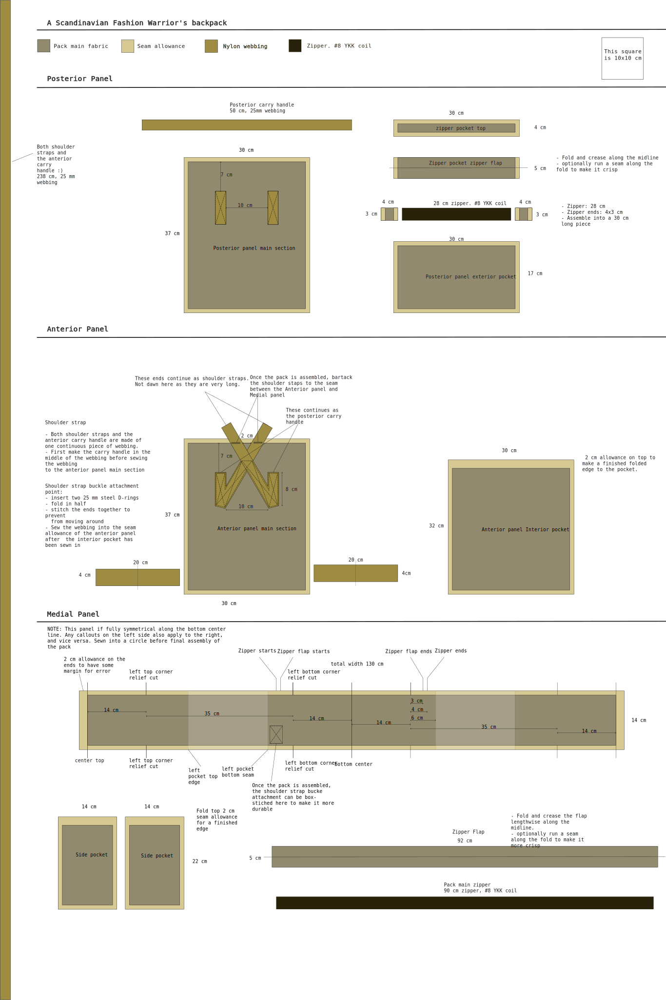
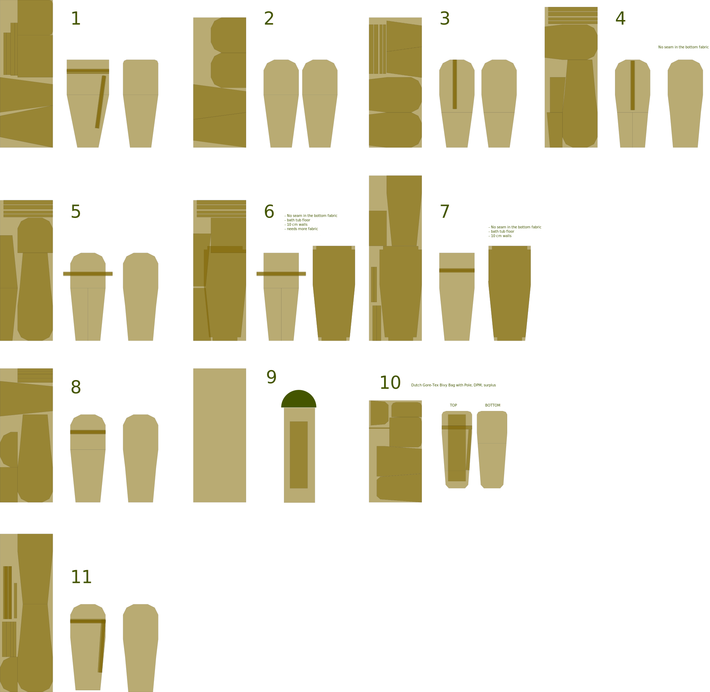

This site is a collection of outdoor gear sewing patterns and instructions. All the patterns are drafted by myself, although some are very heavily influenced by products already on the market. You are welcome to use or modify the patterns for your own projects. Unless otherwise stated, consider everything licensed as Creative Commons – Attribution-ShareAlike CC-BY-SA

# About the patterns

I've always made my own patterns and just learned by trial and error. Essentially all images throughout this site are .svg files (Scalable vector graphics) that I'v drawn in [Inkscape](https://inkscape.org). This means you can zoom in as much as you want without the images getting blurry. If you just want to browse a pattern, you can open the image in a new tab to zoom and pan around. Use Inkscape, Adobe Illustrator, or any other vector graphics program to make arbitrary measurements in the image. The svg files are drawn to scale, so your program will be able to make measurements in physical units like centimeters or inches, not just arbitrary digital units like pixels.
# Load carrying modules

## [shoulder strap, 50mm webbing, with quick release](shoulder%20strap,%2050mm%20%20webbing,%20with%20quick%20release/shoulder%20strap,%2050mm%20webbing,%20with%20quick%20release)

- Simple webbing-only shoulder straps for modular packs.
- Originally designed for  [backpack, daypack, large](backpack,%20daypack,%20large/backpack,%20daypack,%20large)
- I've also used them for carrying large Ortelieb drybags, among other things.
- quick-release adjustment buckles for getting the pack of quickly. (Personally used for skating on sea ice)

## [shoulder harness, yoke](shoulder%20harness,%20yoke/shoulder%20harness,%20yoke)

- The [shoulder harness, yoke](shoulder%20harness,%20yoke/shoulder%20harness,%20yoke) is inspired by a piece of equipment byHill People Gear. It's a single-piece shoulder harness that wraps around the back of the neck, spreading the carried weight over a large surface area. Features a light 5mm padding, Two types of backpack attachment points, buckles for load lifters, and PALS-style webbing at the front for attaching other modules or a sternum strap.  

## [sternum strap, 20mm, modular](sternum%20strap,%2020mm,%20modular/sternum%20strap,%2020mm,%20modular)

Simple shoulder sternum strap module for backpack. Attaches to the shoulder straps with tri-glide buckles.

## [belt, modular, pulk harness](belt,%20modular,%20pulk%20harness.svg)

- Originally cloned from a Jääkäri XL rucksack hip belt.
- I've found the curve on the belt to be unnecessary, and makes the PALS webbing not work as well as it could
    - make a less anatomic belt which is essentially just a long rectangle next time.
    - that would allow full use of PALS which is continuous along the intire length of the bels
    - 

# Packs and bags

## [[bikepack, frame bag sling]]

Very fun concept of a single-shoulder sling bag that converts into a bicycle frame bag.

---

## [backpack, daypack, large](backpack,%20daypack,%20large/backpack,%20daypack,%20large)
	
This is a backpack with modular (detachable) shoulder straps, either in the form of [shoulder straps, detechable, webbing](shoulder%20straps,%20detechable,%20webbing.svg), of [shoulder harness, yoke](shoulder%20harness,%20yoke/shoulder%20harness,%20yoke). It is heavily influenced by Varusteleka CP15 backpack, but it's bigger.

Features:

- PALS webbing on the posterior face and the sides.
- optionally PALS on the bottom panel (personally I find it very useful)
- carry handle
- water bladder pocket & passthrough
- fully opening panel loading zipper
- two zippered inside pockets in the posterior panel

## [Kånken?](kanken/kanken)

Kånken by Fjällräven? I mean, yeah. But no. 

Why? The backstory of the Kånken build was a kind of impractical joke. I eventually sold the pack as the Scandinavian fashion warrior's backpack. The main pack fabric was upcycled from and old german army surplus laundry bag. The Kånken is popular to the point it's a meme around where I live, so I wanted to make one as a joke, but to keep up with the military theme provided by the fabric choice, all the webbing as well as buckle hardware were all heavy-duty Finnish mil-spec stuff from Savotta and Varusteleka. [Read the write up](kanken/kanken) for all the fun details of this up-cycle project.

And full .svg cut pattern available of course.

# Organiziers and trinket bags

## [kit bag](kit%20bag/kit%20bag)

The is a pack that's meant to be carried high in the chest, attached to the front of a backpack houlder harness.

- Lots of elastic webbing and multiple compartments to keep small items organized
- main body large enough to carry hold bigger items
	- binoculars, books, water bottle

## [field note kit, small](field%20note%20kit,%20small,%20zipper.svg)

- small zipper pouch for small field notebook, some pens. Also fits a smartphone
- decent amount of organization possibility
- webbing loop for hanging with a carbine

## field note kit, on lanyard

# PALS pouches

The patterns in this section are some of the PALS pouch modules I've made so far. As I've been using more of them, there are some systematic changes I would make to the patterns to fix some things I'd now consider mistakes. See the [Sewing PALS](techiques/Sewing%20PALS) page for more details on pouch design considerations, but the essential take-away is: maximize the are in the back of the pouch that has a solid PALS connection to the pack. So keep the top row as high up as possible, and the bottom row as low as possible, and design the pattern size in multiples of 1'' × 1.5'' rectangles. Many of the patterns here have approx 1cm of "padding" outside the PALS connection, which make the pouches floppier when attached to the pack.
## pouch, horizontal, 25x16x9 mm

- Nice relatively large pouch that work well for example as a side pouch on a hip belt
- This fits easily for example (not all the same time): binocluars. water bottle and some snacks, all your navigation equipment, a rain jacket and pants, an uninsulated thermal cloak, 3x3 meter tarp, hammock + suspension

## pouch, multitool / ice screw

A long and narrow pouch with a velcro flap enclosure. This pattern is originally for a 21 cm long ice screw, the kind climbers use to make a anchor point into a wall of ice. Those ice screw are also a brilliant tool for measuring ice thickness when moving on sea- or lake ice. This pouch is intended to be mounted in an easy-to-reach place to make measuring ice thickness more convenient, and therefore make the ice traversal safer. 

## pouch, lidded, 2x3

- Mainly designed to fit a 1 litre water bottle, although I now prefer one that is 3 columns wide.

---

## pouch, 2x2, small, 0.9L, zipper

- a cute little Pokemon ball of a pouch
- good for stuffing snack wrappers and other trash while on the move

## pouch, vertical, 5x5, zipper

## pouch, vertical, 3x5, zipper

---

# Clothing

## [tube scarf](tube%20scarf/tube%20scarf)

Simple one-seam Buff -style tube scarf

## [beanie](beanie/beanie)

## [swiss army mitten.svg](mitten.svg)

- Toasty mittens with long cover over the forearm.
- The thumb works, but is a bit tricky to sew. It could use some improvement by using some other topology

## [anorak](anorak), [anorak.svg](anorak.svg)

Work in progress, probably won't be completed.

# Shelter equipment

## [hammock, 3.1 meters, channel gathered end](hammock,%203.1%20meters,%20channel%20gathered%20end.svg)

- Basic hammock from ripstop nylon
- goes well with a whoopie sling on one end and a ladder string on the other end. Made from amsteel.

## [thermal cloak](thermal%20cloak/thermal%20cloak)

- a blatant rip-off of the Särmä TST thermal cloak

## [Bivy bag](bivy/bivy.svg)

In an effort me make a bivy bag, I've iterated through a number of potential patterns. I've sewn one bivy using pattern 11. Many different alternatives for bivy bags. These are meant to be sewn in a Gore-tex -like waterproof breathable fabric. I've been using Foxa [Foxshell, tapeversion](https://foxa.fi/en/products/foxshell-tape-version)  supplied by [Shelby outdoor](https://www.shelbyoutdoor.com/product_info.php?cPath=402_22_34_591&products_id=6385)

Each patterns has a cut layout for most optimal fabric usage as well as top and bottom panel assembly images.

## [sleeping pad sleeve with groundsheet](sleeping%20pad%20sleeve%20with%20groundsheet)

- inspired by Finnish defence forces sleeping pad by savotta
- PU coated Nylon fabric with high water column tolerance (10 000 mm)
- built-in elastic loop to keep the pad roolled up
- Allows inserting a foam sleeping pad (or two) inside a waterproof sleeve with extra "wings" to make the mat wider
- Wing don't provide insulation, but they are waterproof and act as a groundsheet to give more clean surface around the pad
- particularly useful for activites where you spend a lot of time on the ground without a tent.
- for cold weather, add an aluminum reflective mat in addition to a foam pad for extra warmth (kaira extreme, for example)
- use a simple thin pad in the summer when extra insulation is not needed

## [sleeping bag liner](sleeping%20bag%20liner)

- e.g polarfleece
	- on later thought, fleece compresses poorly and it turns out to be very bulky is made with polarfleece
- 75 cm width if using regular 150 cm wide fabric
	- most are 90 cm wide, but sold as one size and also fit bigger people
- polar fleece weight 250 g/m^2 => 2 meter of fabric is 750g
	- mummy shape will reduce some of that weight
- attachment point for carinthia Defence or Tropen bag.
	- Tropen attachemnts
		- one on either side of the footbox (loop both inside and outside)
		- midway down the length of the sleeping bag on either sides. (loop on the inside, nothing on outside)
		- on either side at the shoulders. (loop inside, nothin on outside)
	- defence 4
		- 4 in the hood
		- either side half way down
		- either side of the foot footbox
		- one at the center of the footbox
		- all are loops

# Notes on Sewing

I have a tendency to of trying to remember how to do something, and then having to figure it out yet again because some detail is missing. Just easier to write notes for yourself.

## [Sewing PALS](techiques/Sewing%20PALS)

When I started out my PALS webbing would always get ripped out and be useless because I was sewing them incorrectly

## [pattern lexicon and naming conventions](techiques/pattern%20lexicon%20and%20naming%20conventions)

Poor spatial vocabulary is a pet peeve of mine. 

## Verctor illustrations of buckles and materials 

My [buckles.svg](buckles.svg) file has become somewhat of a reference library for pattern illustrations to keep the patterns uniform from project to project. Of course some older pattern don't follow this style guide. 

If you need vector illustration of buckles, feel free to rip these off. The side release buckles are traced from ITW-Nexus buckles.

