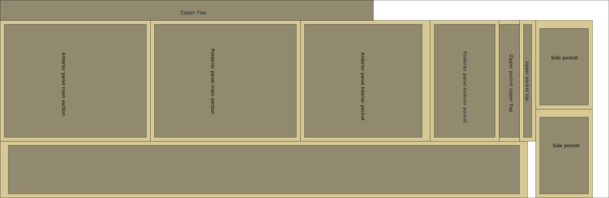

# Overview

# Materials

| Material | Quantity | Note |
| ---- | ---- | ---- |
| main fabric | 50 cm |  |
| #8 YKK |  |  |

# Cut 

The Kånken pattern requires 50 cm of 150 cm wide fabric. Here is a nice compact cut pattern that won't waste a lot of fabric:

# Construction

