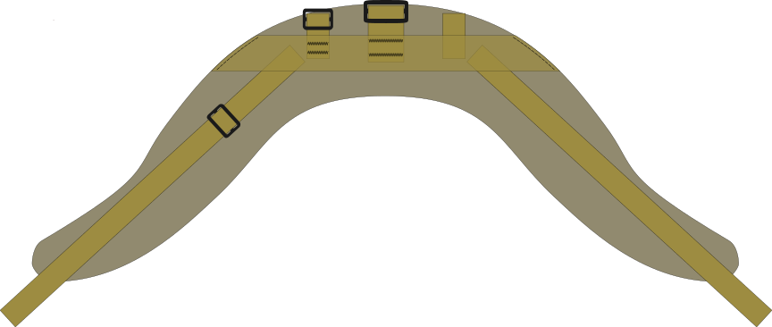
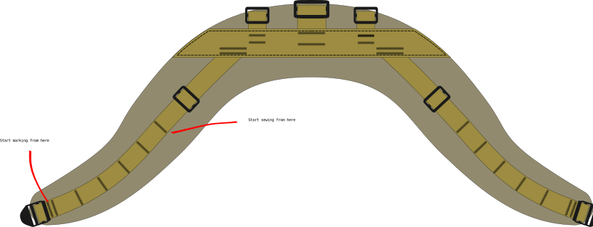
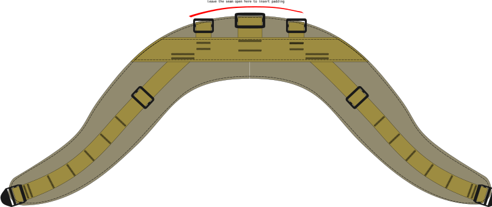

This is a modular yoke style harness inspired (nearly copied) by the Hill people gear shoulder harness that they sell with their various packs.

Shoulder harness features:

- both shoulder straps are part of the same piece that wraps around the neck
- spreads load on a wide surface area
- shoulder harness module: the pack itself may be changed
- buckle for load lifters
- PALS style webbing at the front for attaching module
	- [sternum strap, 20mm, modular](../sternum%20strap,%2020mm,%20modular/sternum%20strap,%2020mm,%20modular) compatible
	- [shoulder strap pocket] compatible
	- [kit bag](../kit%20bag/chest%20pack.svg) compatible

I've used this for example with

- [[backpacbackpack, daypack, large]
- [backpack, small, rolltop, utility shoulder strap]
- Savotta Jääkäri XL, with some additional modules to the ruck frame

# CAD files

All the pattern images are available as a .svg vector file here: [shoulder harness, yoke.svg](shoulder%20harness,%20yoke.svg). The pattern is drawn to scale.

# Materials

material | amount
---------|--------
25 mm webbing |  88cm + 25cm
40 mm webbing | 52 cm
main fabric | 40 cm
padding foam | one 40cm x 80cm piece
tri-glide buckle, 25mm | 4 pcs
tri-glide buckle, 40mm | 1 pcs
ladderlock, 25mm | 2 pcs
edge binding | 3 meters
thread | Zwilon 60 bonded nylon

See **Acessories** section for additional modules you may want to include with this shoulder harness. Those materials are not listed in the table above.

# Drafting the pattern

It's important to note, that the shape of the yoke is provided by the cut pattern of the bottom- and top fabric. The specific pattern presented here is one I've drafted for myself to fit my body. You may want to consider drafting you own shape, and adapting the pattern. Unlike some simpler shoulder straps, yokes are not a one-size-fits-all solution in my experience. 

# Cut

1. cut 25 mm webbing (4 pieces)
2. cut 40 mm webbing (1 piece)
3. cut the top and bottom panels from the main fabric. Two identical pieces
4. cut the foam padding using the same pattern as the main fabric

# Construction

TL:DR: in short, sew all the parts of webbing to the right side of the top fabric. Hide ends of all the webbing underneath the 40mm strain relief webbing. Then sew the bottom and top fabrics together, wrong sides facing each other. Leave a opening to slip in the foam before completing the seam. Edge bind or otherwise finish the edges.

---

In the original Hill people gear product, all the stitching is done through both layers of fabric and the foam such that bar tacks in the webbing are visible on the bottom side of the shoulder harness. I have bad experiences with load carrying equipment constructed this way, as the bar tack are hard and can start chafing. My recommendation is to have all the webbing and the top fabric as one assembly. The bottom panel is only sew on later.

## Strain relief and attachment points

1. place the strain relief webbing on the right side of the top fabric
2. Baste the strain relief into place.
	1. I like to sew a line of stitches at the ends of the webbing along the edge of the top fabric to hold the webbing in place.
3. For all three pack attachment points:
	1. fold the webbing in half
	2. thread the tri-glide buckle into place
	3. slip the ends of the folded webbing in between the strain relief and the main fabric
	4. check the tri-glide is right-side-up
	5. sew in attachment point with two parallel bar tacks
	6. trim the excess strain relief strap corners and melt the ends

### Shoulder straps

The shoulder strap webbing should ideally lie in the middle of the shoulder strap. Use chalk or a marker to mark the center line along the fabric

1. mark the center line along which the shoulder strap webbing should be
2. slip one end of the shoulder strap webbing under the strain relief
	1. the webbing should start along the marked center line
3. bar tack twice the shoulder strap webbing to the strain relief 
4. thread the load lifter tri-glide buckles onto the shoulder strap webbing

## PALS & adjuster buckle

PALS uses a bar tack every 1.5 inches.

1. start **MARKING** the PALS bar tacks every 1.5 inches starting from where the adjuster buckle is.
	1. remember, don't mark the first tack too close to the edge of the fabric. Otherwise the webbing will be in the way when finishing/binding the edges of the complete harness.
	2. The first PALS bar tack is doubled to secure the adjuster buckle
	3. make the first tack ~1 inch away from the edge of the fabric.
2. Start **SEWING** the PALS bar tacks starting from the neck, going down to the adjuster buckle
	1. keep the fabric flat when sewing, and the webbing as flat as possible
	2. The webbing needs to curve a little between bar tacks, it will not be entirely flat against the fabric
3. thread the adjuster buckle onto the webbing before sewing the last PALS loop
4. fold the end of the webbing so the last PALS bar tack also secures the adjustment buckle
5. lastly, sew the strain relief webbing top fabric by stitching along perimeter of the strain relief 

## Bottom fabric & padding

The entire load bearing assembly should be done by this point. The last step is to sew the top and bottom panels together, and insert the foam padding. 

1. lay the bottom fabric and the top fabric assembly on top of each other, wrong sided facing together
2. carefully align and clip/pin/baste the fabric panels
	1. the PALS webbing may cause the top fabric to not lay flat, which makes it important to sure the panels stay aligned while sewing.
3. sew the panels together by stitching along the perimeter of the harness
	1. leave a gap in the seam in the center by the pack attachment points 
4. slip the foam padding in through the gap in the seam
5. adjust the size of the foam padding if needed and re-insert
6. finish the seam
7. bind the edges of the harness for a finished edge

**The harness should now be done**

# Accessories

Depending on what pack you use with the shoulder harness, it may be useful to have some additional accessories.

## Load lifter straps

For bigger packs it's nice to have load lifters. When using the center attachment point for suspension, load lifers are required. 

This assumes the pack has asdjustment the adjustement buckesl. We just need to provide the load lifter strap itself.

1. cut 2 lengths 50cm of 20mm or 25mm webbing (whatever matches the adjustment buckle on the pack)
2. bar tack a 5 cm loop on one end of each piece of webbing (a grab handle)
3. attach one end to the shoulder harness' tri-glide buckle
	1. flollow the shoulder strap through the tri-glide, and double back to secure the load lifter in place
4. thread the end with the loop though the tension buckle on the pack

## Pack attachment utility strap

Different packs may have different ways of attaching to the shoulder harness. For packs with two d-ring attachment points, use a [utility strap, short](../utility%20strap,%20short/utility%20strap,%20short)

To attach the pack:

- thread the utility strap thought the D-ring on the pack
	- the tri-glide on the strap must be large enough that it doesn't fit through the D-ring
- weave the free end of the utility strap through the tri-glide on the shoulder harness

## Sternum strap

[sternum strap, 20mm, modular](../sternum%20strap,%2020mm,%20modular/sternum%20strap,%2020mm,%20modular) fits well as a sternum strap for this harness. It attaches with tri-glide buckles to the shoulder straps. The PALS loops help set the height at which the sternum strap sits.

