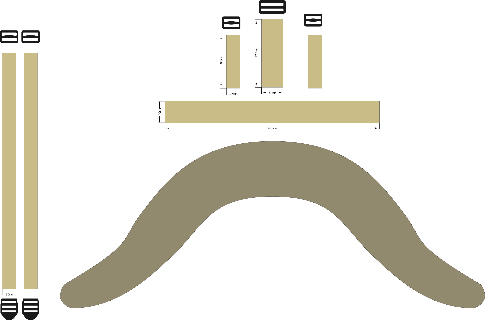

This is a modular yolk style harness inspired (nearly copied) by the Hill people gear shoulder harness that they sell with their various packs.

Shoulder harness features:

- both shoulder straps are part of the same piece that wraps around the neck
- spreads load on a wide surface area
- shoulder harness module: the pack itself may be changed
- buckle for load lifters
- PASL style webbing at the front for attaching module
	- [sternum strap, 20mm, modular](sternum%20strap,%2020mm,%20modular.md) compatible
	- [shoulder strap pocket] compatible
	- [chest pack](chest%20pack.svg) compatible

I've used this for example with

- [[backpacbackpack, daypack, large]
- [backpack, small, rolltop, utility shoulder strap]
- Savotta Jääkäri XL, with some additional modules to the ruck frame

# Materials

material | amount
---------|--------
25 mm webbing |  88cm + 25cm
40 mm webbing | 52 cm
main fabric | 40 cm
padding foam | one 40cm x 80cm piece
tri-glide buckle, 25mm | 4 pcs
tri-glide buckle, 40mm | 1 pcs
ladderlock, 25mm | 2 pcs
edge binding | 3 meters
thread | Zwilon 60 bonded nylon

# Drafting the pattern

It's important to note, that the shape of the yolk is provided by the cut pattern of the bottom- and top fabric. The specific pattern presented here is one I've drafted for myself to fit my body. You may want to consider drafting you own shape, and adapting the pattern. Unlike some simpler shoulder straps, yolks are not a one-size-fits-all solution in my experience. 

# Cut

1. cut 25 mm webbing (4 pieces)
2. cut 40 mm webbin (1 piece)
3. cut the top and bottom panels from the main fabric. Two identical pieces
4. cut the foam padding using the same pattern as the main fabric

# Construction

TL:DR: in short, sew all the parts of webbing to the right side of the top fabric. Hide ends of all the webbing underneath the 40mm strain relief webbing. Then sew the bottom and top fabrics together, wrong sides facing each other. Leave a opening to slip in the foam before completing the seam. Edge bind or otherwise finish the edges.

---

In the original Hill people gear product, all the stitching is done through both layers of fabric and the foam such that bartacks in the webbing are visible on the bottom side of the shoulder harness. I have bad experiences with load carrying equipment constructed this way. My recommendation is to have all the webbing and the top fabric as one assembly. The bottom panel is only sew on later.

## Load bearing assembly

### Attachment points

1. place the 40mm strain relief webbing on the right side of the top fabric
2. sew a line of stiches at the ends of the webbing along the edge of the top fabric to hold the webbing in place.
3. For all three pack attachment points:
	1. fold the webbing in half
	2. thread the tri-glide buckle into place
	3. slip the ends of the folded webbing in between the strain relief and the main fabric
	4. check the tri-glide is right-side-up
	5. sew in attachment point with two parallel bar tacks

### Shoulder straps

The shoulder strap webbing should ideally lie in the middle of the shoulder strap. Use chalk or a marker to mark the center line along the fabric

