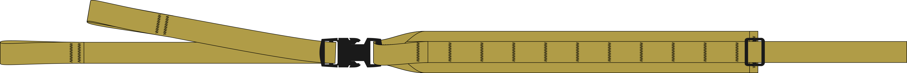
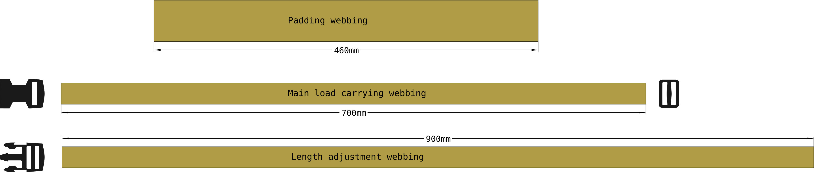
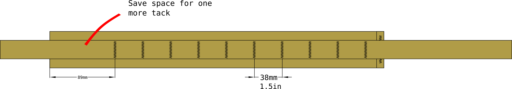
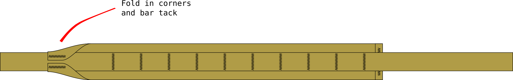
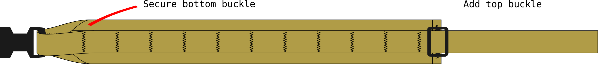
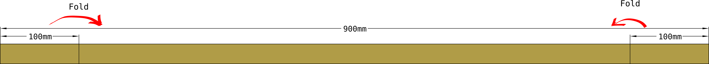
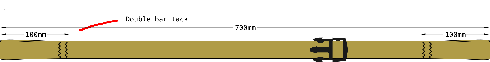

A pair of shoulder straps I originally made for use while nordic skating (ice skating on sea ice). 

Notable features:

- Made from only webbing and buckles to dry fast if soaked in sea water after falling through the ice
- ITW nexux side-relase buckles instead of a typical adjustment buckles make the backpack is easy to take of while in the water after falling through ice. Just open the side release buckles to get the pack off your back. 
- top intended to attach to a D-ring on the pack using a tri-glide buckle
 
Two pairs of finished shoulder straps. One with Quick release and the other with a conventional adjustment buckle:

# Sewing pattern

The full .svg vector drawing of the sewing pattern is available here: [shoulder strap, 50mm webbing](shoulder%20strap,%2050mm%20webbing.svg)

# Materials

Material for one shoulder strap. You'll need double to make a pair.

material | amount
--|--
webbing, 50mm | 46 cm
webbing, 25mm | 1.6 meter
tri-glide, 25mm | 1 pcs
side release buckle, plug | 1 pcs
side release buckle, receptacle | 1 pcs

The side-release buckles are optional. You can change the plug-receptacle pair to a conventional adjustment buckle.  

# Cut pattern

Cut the webbing to length according to the pattern.

- 3 pieces total. 
- melt the cut ends to stop fraying

# Construction

Start by assembling the main *load carrying webbing* and *padding webbing*. Set the *length adjustment webbing* aside for now

1. Finish right end of the padding webbing 
	- make a fold 1 cm away from the end  
	- make a bar tack parallel to the fold to make the fold permanent
2. attach the load bearing webbing to the padding
	- make a bar tack 1 inch away from the folded edge of the padding

3. Sew in all but one of the [PALS](../techiques/PALS.md)  bar tacks
	-  to get uniform tension, start form the right end, and work your way toward the left one PALS loop at a time
	-  leave space in the left end to secure the adjustment buckle
	- PALS bar tacks are spaced 1.5 inches apart

4. Taper down the left end of the padding webbing.
	- fold the padding lenghtwise as close to the load bearing webbing as possible
	- use clips to keep the padding folded while sewing
	- make a bar tack parallel to the webbing to keep the corner down.
	- this step is optional, but I don't like the padding corners protruding

5. Thread the side-release buckle receptacle onto the end of the load bearing webbing
6. fold the remaining end of the load bearing webbing back onto itself
7. Secure the buckle and close the loop with a bar tack
	- this is also serves the purpose of the last bar tack of the PALS loops
8. thread the tri-gilde buckle onto the 

 
## Length adjustment webbing

Set the finished assembly aside and work on the *length adjustment webbing*. Shoulder length adjustment webbing is simply a length of webbing with 10cm long loops at both ends. It is attached either to the external frame of a pack, a D-ring, or other suitable attachment point on a pack

1. at both ends, make a fold 10 cm from the end

3. make the folds into loops with two parallel bar tacks
4. thread the side-release buckle onto the webbing

# Usage 

On packs with D-ring attachment points

# Compatible modules

You may want to combine this with:

- [sternum strap, 20mm, modular](../sternum%20strap,%2020mm,%20modular/sternum%20strap,%2020mm,%20modular) fits to this shoulder harness
- [backpack, daypack, large](../backpack,%20daypack,%20large/backpack,%20daypack,%20large) is designed to use these as one shoulder harness option
- [backpack, small, rolltop, utility shoulder strap](../backpack,%20small,%20rolltop,%20utility%20shoulder%20strap.svg) can be attached, although it was not originally designed to do so

# Quick release for nordic skating

Carrying a backpack with rescue equipment and dry clothes is essential for nordic skating. The dry clothes are for when the ice breaks, and you inadvertently end up going for a swim in zero degree water. As you should be expecting to swim, the dry clothes should be in a watertight drybag. The drybag has a secodary purpose as well: to keep the pack floating in the water. 

