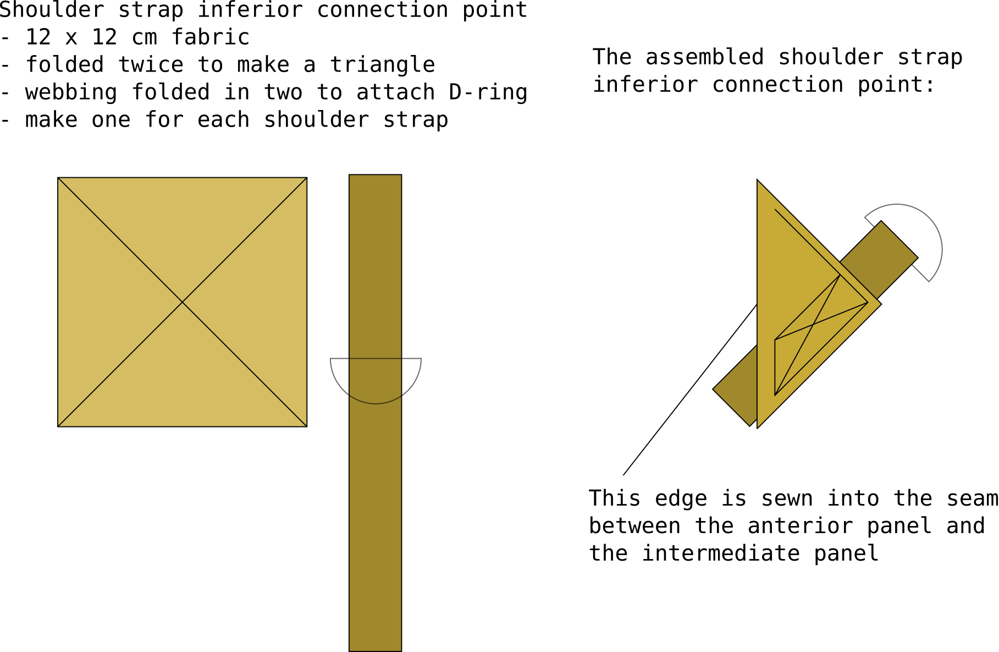

# Large daypack with PALS webbing and detachable shoulder straps

## Patterns for all pieces

The pack is made from 4 main pieces:

- anterior panel
- posterior panel
- intermediate panel
- inferior panel

Annotated patterns drawn in to-scale SVG (scalable vector graphics) available here:

- [backpack, daypack, large](backpack, daypack, large.svg)

Regarding reading the pattern, many of the directional terms are borrowed terms from medical anatomy, since I find they are less ambiguous in my opinoin. In case it's confusing, you'll be fine by translating as:

- inferior: bottom
- superior: top
- anterior: front
- posterior: back

## Finished piece

The length of the intermediate panel determined by clipping a measuring tape to the anterior panel template. 120 cm intermediate panel length is sligthly excessive, but can be cut afterward.

## Posterior panel

The posterior panel is

## Shoulder strap inferior connection point

Make one for each shoulder strap.

Materials per each:

- Square piece of pack main fabric
- Webbing
- D-ring

The _inferior section_ of the shoulder strap is connected to the pack with a steel D-ring.

- Fold the rectangular piece of fabric twice to make a triangle
- first fold made so wrong sides of the fabric face each other
- fold the length of webbing in half, leaving the D-ring in the fold
- insert the folded webbing into the second fold of the fabric

# Posterior panel

The exterior face of the posterior panel has [Sewing PALS](../techiques/Sewing PALS) webbing, a patch of velcro loop, and the side release bulckle resptacles for the compression straps. You may also leave the compression strap buckles, and opt for a beavertail instead.

