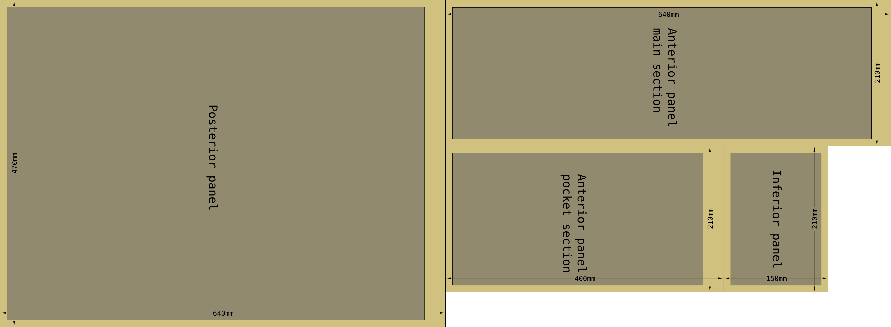
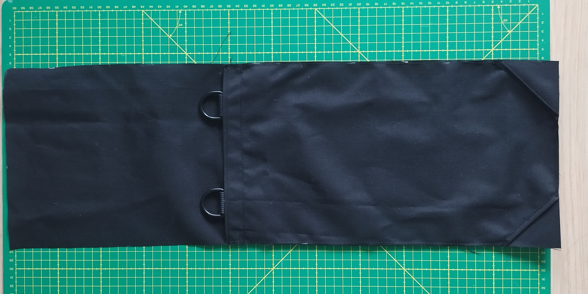

Backpack, small, rolltop
========================

Essentially a rolltop sack with a couple of buckles so it can be converted into a small backpack by adding a utility pair of utility straps as the shoulder hanrness. Also has an outer pocket that can be used for foam padding to increase carrrying comfort.

This bag is somewhat insipred by Savotta Hatka and Varusteleka's DP10 daypacks. This version is kept intentionally simple, and does not include features such as PALS webbing of modular attachment points to use the bag a a clamshell or larger packs.

.. image:: IMG_20230601_001823.jpg

Materials
---------

.. raw:: html

    
Pattern parameters

    <table id="bill_of_materials" class="table"></table>
    
    

    

The pack consists of one main fabric that functions as both the posterior and medial sections of the pack. The anterior panel is made up of two layers: the main section and the pocket section that creates the exterior pocket where the foam pad and carrying harness can be stowed.

.. image:: overview.png

Cut
---

Suggested cut pattern for 140cm wide fabric rolls

Construction
------------

Finish the top edge of the pocket section with a folded edge. Fold the seam allowance to the wrong side of the fabric. Similarly finish the bottom corners of the pocket panel by folding off a 6x6cm triangle from each of the corners. The adjustment strap buckles will stow through the holes that the triangles will create.

.. image:: pocket.png

.. image:: anterior-panel-main-section.png

Accessories 
-----------

You may consider using 
:doc:`../adapter,-cross-bag-compression-strap/adapter,-cross-bag-compression-strap`
to attach this type of bag to the exterios of a larger rucksack to use as a daypack.
