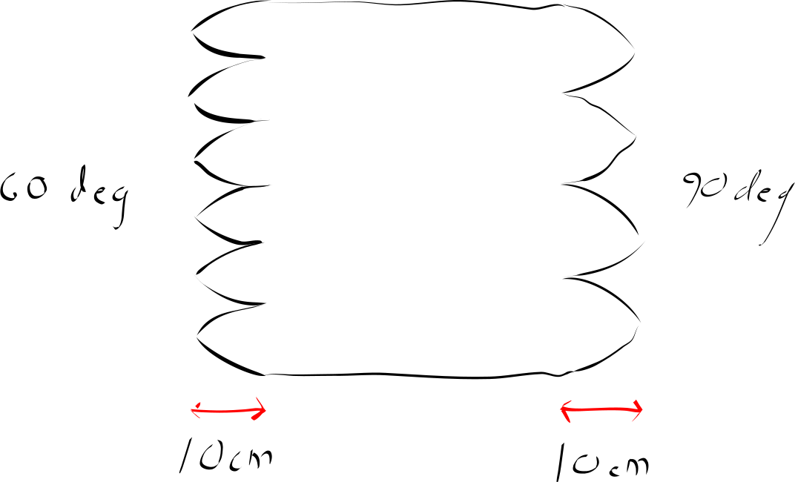
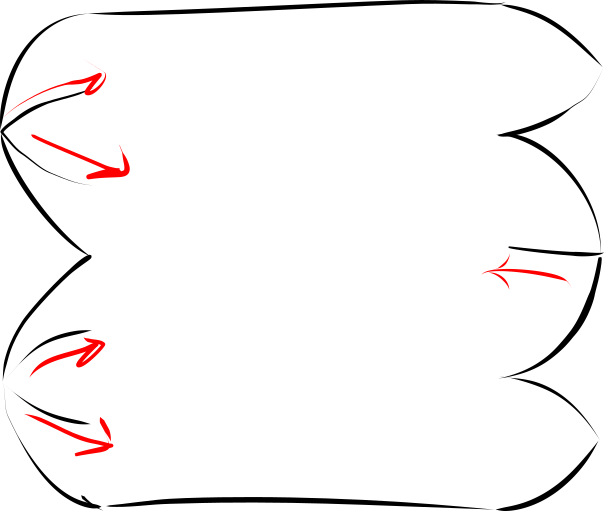
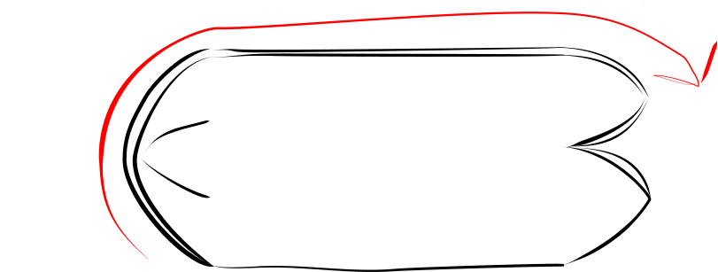
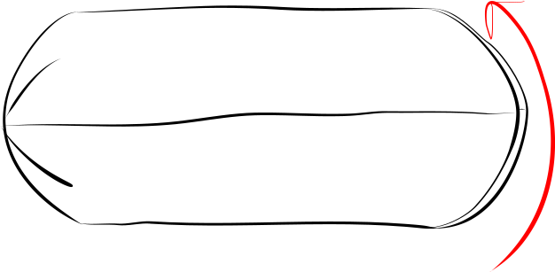

# Beanie 

## Materials

| Material | quantity | note |
| ---- | ---- | ---- |
| main fabric | 0.6 meter | stretchy knits or fleece |

## Cut

- 60 x 50 rectangle 
- 6 darts, each dart 10 cm long

The 50 cm edge is the perimeter length of the beanie. The higher stretch should be along that direction

## Construction

sew the darts in this order:

- superior end left 1 and 2
- superior end right 1 and 2
- superior end anterior and posterior darts as one seam. Keep going all the way until the end of the inferior posterior dart.
- inferior anterior dart
- Now turn the fabric right-side-out
- finish the hat by sewing the posterior left and right darts in one seam. This seam is done with wrong sides facing eachother. So the seam allowance will be left visible.

Cut the darts

- 60 degree points on the superior end
- 90 degree points on the inferior end

Fold over the center along and sew 

Fold the fabric outrside-out and finish by sewing the two remaining darts. Sew both in one seam.

The beanie is now ready. Fold the interior end inside the exterior end, and then fold the brim of the hat up to a suitable height.

## Accessories

Use the same materials to make a [tube scarf](tube scarf/tube-scarf) or as the lining in a pair of [mittens](../mitten.svg)
