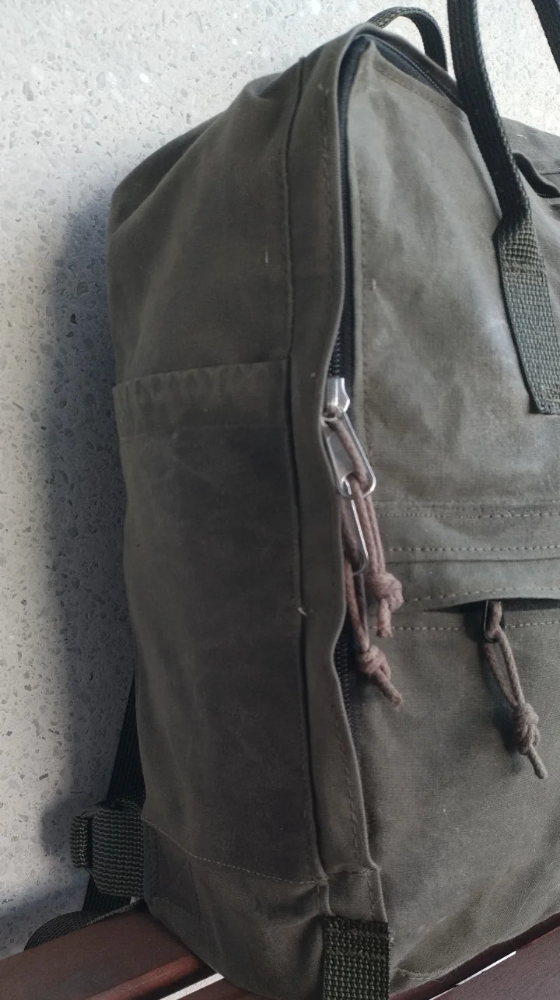

# Kånken, kind of...

## Materials

| Material | Quantity | Note |
| ---- | ---- | ---- |
| main fabric | 50 cm | Some nice stiff & durable fabric.  |
| #8 YKK | 90 cm + 28 cm | This can be tape by-the meter. No terminations necessary |

## Cut 

The Kånken pattern requires 50 cm of 150 cm wide fabric. Here is a nice compact cut pattern that won't waste a lot of fabric:

## Construction

This pattern was drawn before I documented patterns on this site. You may want to open the below image in a new tab to freely zoom & pan. Or better yet save the file and open it with a vector graphics program like [inkscape](../techiques/inkscape).

## Wax treatment

The military surplus laundry bag fabric was ok, but nothing too impressive. Some type of canvas-like mostly-cotton weave. I treated the fabric with copious amounts of Greenland wax, a mixture of paraffin and bee wax, to make the material stiffer and more weather resistant. Also this played into the joke of making a Kånken, since Fjällräven also loves to advertise their wax for gear made from their G-1000 material. 

To get a well-saturated fabric, apply the wax before cutting and sewing: making large areas at a time will help to get a more even treatment.

1. Melt the wax in a pot or just a tin can of any kind. It doesn't need much heat to melt.
2. Apply the melted wax to the fabric with a wide paint brush. It will harden on the surface quite quickly, but it doesn't matter. 
3. Use a clothes iron (or better yet a ski waxing iron) to melt the wax again and make it seep into the fabric. Put a piece of baking paper between the iron and the fabric if you want to keep you iron clean and prevent the wax from gunking up the steam vents on the iron.
4. Repeate until satisfied. 

## Project photos

