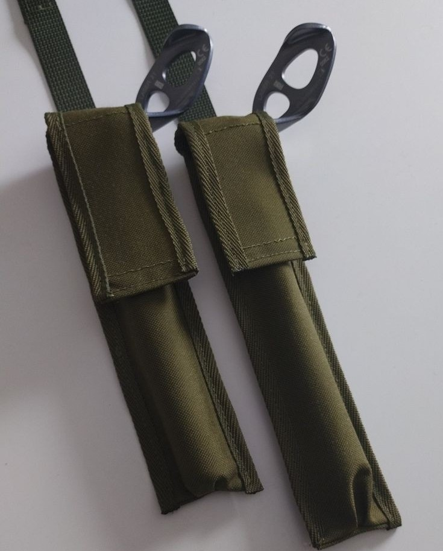
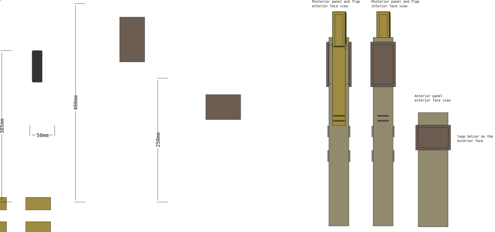

# Pouch, multitool (ice screw)

This pattern is originallly made for fitting one ice-screw meant for ice climbing. 
Apart from their inteded use as a protection while climbing, ice-screws are also brilliant tool for easily measuring ice thickness when moving on sea- or lake ice during the winter. A 21 cm ice screw will drill thought the sea ice easily and quickly to let you know how thick the ice is.
 

## Materials

- < 10 cm of main fabric
- 50mm wide velcro hook & loop
- edge binding
- webbing, 25mm, for PALS attachments
- PALS webbing plastic end stiffeners

## Pattern Sketch

