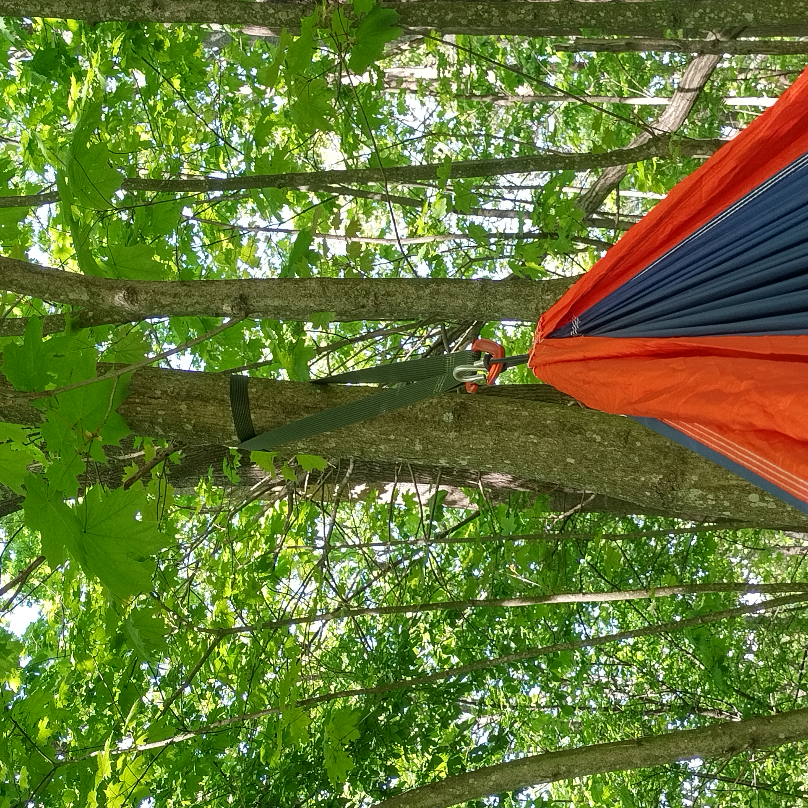
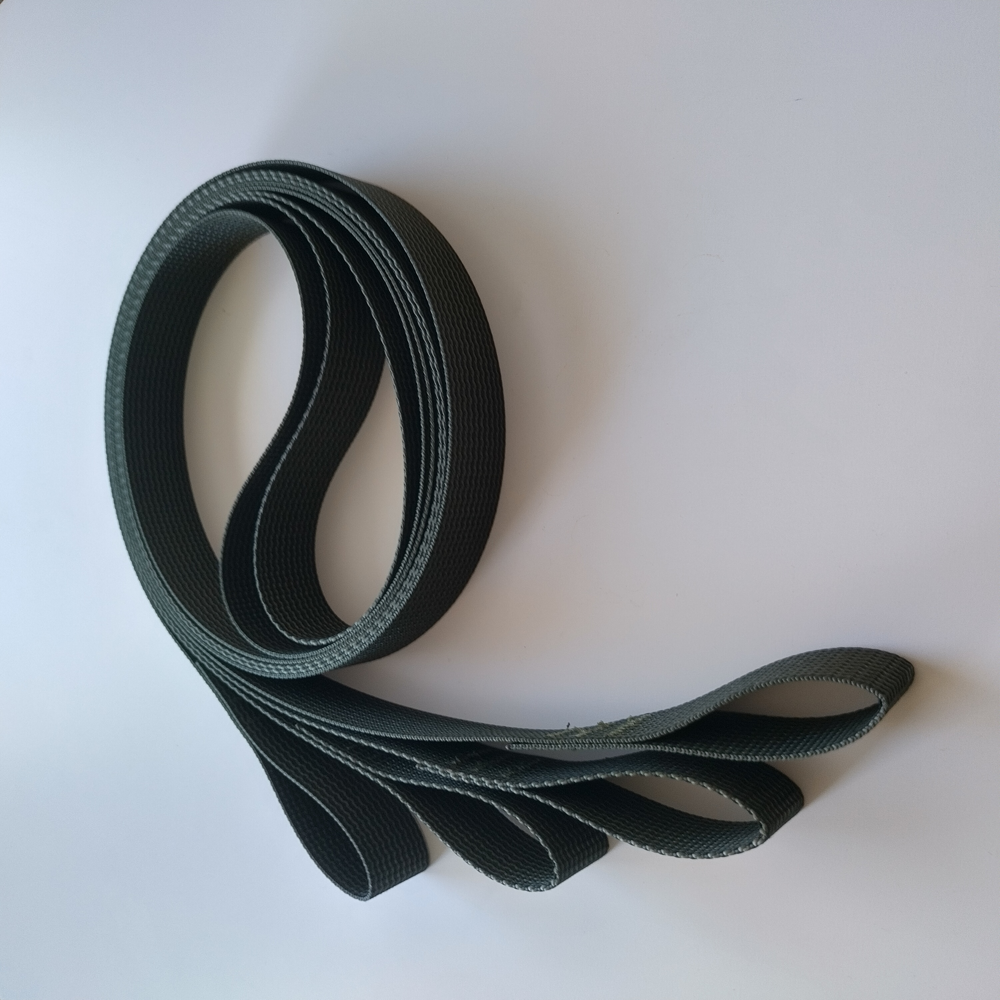

Puunhalaajat
============

SKU:W005G

Tarjolla olisi ns. puunhalaajat riippumattoon. Eli yksi pari (2kpl) 2 metriä pitkiä hihnoja joiden päätyihin on huolella ommeltu vahvat 10cm kokoiset lenkit.

 
Pyynnöstä saa myös mustana tai muissa väreissä. Ja mikäli retkikohteissasi on erityien paksurunkoisia puita, niin voin valmistaa myös pidemmät kunhan siitä sovitaan.
 
Puunhalaajat ovat parhaillaan silloin, kun ne laittaa kokonaisen kierroksen puun ympäri, ja kiinnittää riippumaton narun karbiinihakasella site, että molemmat hinan päädyt tulevat karbiiniin, kuten alla olevassa kuvassa.

 
Suuremilla puilla puunhalaaja voi myös tehdä vain polven puun ympäri jos mitta ei riitä koko kierrokseen, mutta se saattaa silloin helpommin valua alas puuta pitkin ajan mittaan.

Materiaalit
-----------

- Savotta 25mm hihnanauha, vihreä
- Erittän vahva Zwibond bonded nylon lanka lenkkien ompeleissa

.. image:: ../treehuggers/treehuggers1.jpg
    
