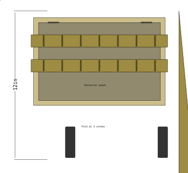

# Spacing

- use 1 inch / 25mm webbing
- 1 inch distance between rows
- 1.5 inch distance between columns


# Strong enough bar tacks

Making PALS webbing requires lost of bar tacks that should ideally be strong enough to withhold the full weight of whatever they are sewn into. PALS webbing on the outside face of backpacks is a natural place to grab when picking up a pack from the ground. Assume as some point someone grab a single loop, and lift the entire pack.

On a household machine I typically use:
- 1mm stitch length
- 3mm stitch width
- Gütermann "Zwilon 60" bonded nylon thread

To make the bar tack:
- start from the middle of the webbing
- backstitch all the way to the rear edge
- front stitch all the way across to the near edge
- backstitch back to the center


There are fancier ways to make bar tacks, but this method has proven itself to be good enough, and is easy to sew on a household sewing machine. Starting and ending the stitching in the middle of the bartack is essential. If the start or the end are too close to the edge of the webbing the seam will eventually start fraying or rip out completely.

# PALS connector strap stiffener

To make a Savotta / Varusteleka style vertical PALS attachment strap, you sew piece of plastic stiffener inside a 3 inch fold at the end of a the connector strap.

## Materials

-  [1 mm think polyethene sheet](https://www.shelbyoutdoor.com/product_info.php?products_id=2858) or a similar ready-cut [1mm polyethene tape](https://www.shelbyoutdoor.com/product_info.php?products_id=783) for the stiffener
- 1 inch wide webbing

Webbing length is calculated as 

```
length = 2 + rows * 2 + 6
```




## Construction


