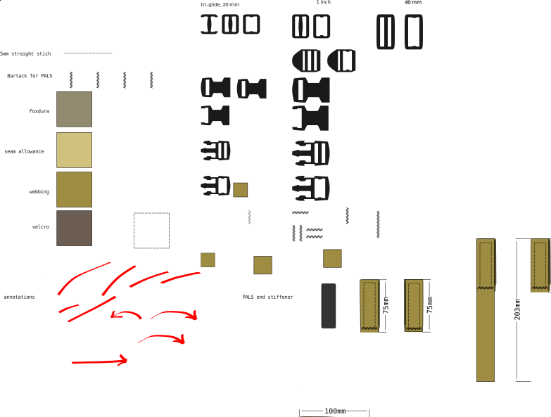

# Pattern documentation guidelines

## Size callouts in Inkscape

Although you can make all the measurements in inkscape, it's nice to have ready-made size callouts in images. Especially
since sooner or later any pattern will be sent somewhere as a pdf or png instead of the original SVG, and you never know if the physical measurement units will remain constant.

To add size callouts in inkscape, do the following:

1. Select the object
2. open  *Path* > *Path* *Effect* panel
3. press `+`
4. add "*Measure Segments*" effect

For readability, in the **General** tab, set:

1. Unit: mm
3. Font: Monospace Regular, 28
4. Position: 10
5. Line width: 0.50

In the **Options** tab:

1. Precision: 0
2. Blacklist segments
	1. use separate indexes with comma
	2. check *invert blacklist* to whitelist segments

## Visual styles

The visual style guide in buckles.svg has slowly evolved to ensure that the SVG files are readable in as many contexts as possible.

- do not use 'hairline' stroke. It is very inconsistent with how it's rendered. Instead use e.g a 0.5mm stroke width.  Set Inkscape to use the bounding box of the pure path geometry, not the rendered geometry. Otherwise the stroke width will be added as padding to the shape bounding box, and cause misalignments in the illustrations
- avoid using transparency. Browsers and image viewers are inconsistent in how they display transparent objects. It may difficult to understand images.

