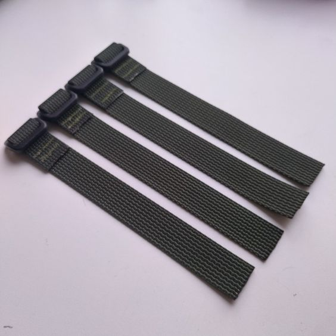

28 cm length of 25mm wide webbing. One end folded and sewn around center post of tri-glide buckle. Used for attaching rucksack bag to external frame.

# Materials

Material for one strap

|material|amount|
|---|---|
|25 mm webbing          | 28 cm  |
|tri-glide buckle, 25mm | 1 pcs  |
|thread                 | Zwilon 60 bonded nylon|

# Construction

1. cut the webbing to length
2. fold where marked
3. thread the tri-glide buckle center post into the fold
4. check the buckle is right-side-up
5. bar tack twice to secure the buckle

# Usage

- Savotta Jääkäri XL type pack-to-frame attachment
- [shoulder harness, yolk](../shoulder%20harness,%20yolk/shoulder%20harness,%20yolk.md) pack-to-harness attachment
- [chest pack](../kit%20bag/chest%20pack.svg) suspension from back pack shoulder harness that has a D-ring

